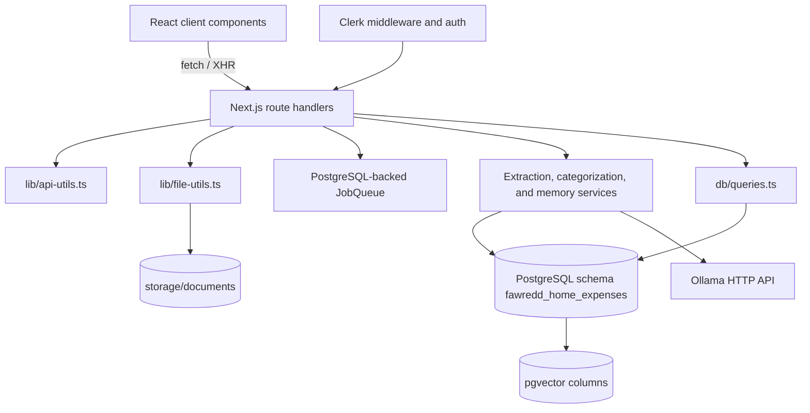
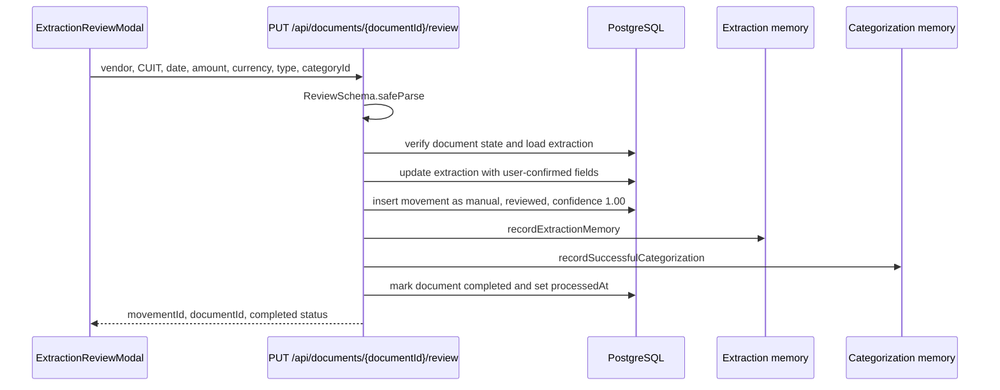
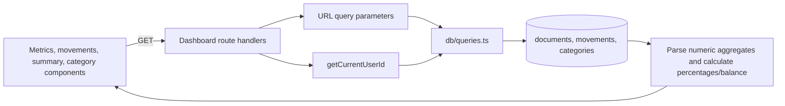

# Verified Data Flow

This document describes the behavior visible in the current source tree. It does not treat `.agents/` artifacts or comments as implemented runtime behavior unless the corresponding source path exists.

## System Flow



## Upload and Processing Flow

```mermaid
sequenceDiagram
    participant UI as UploadComponent
    participant API as POST /api/documents/upload
    participant FS as Local filesystem
    participant DB as PostgreSQL
    participant Q as PostgreSQL-backed queue with local execution loop
    participant EX as Extraction service
    participant MEM as Extraction memory
    participant CAT as Categorization service

    UI->>API: multipart FormData files
    API->>API: validate MIME, extension, size, magic bytes
    API->>FS: saveFile(buffer, filename)
    API->>DB: insert documents metadata and userId
    API->>DB: insert or reuse document by user + file fingerprint
    API->>Q: insert or reuse deduplicated extract job
    API-->>UI: success response with document metadata
    Q->>EX: extractDocumentData(file, mimeType)
    Q->>DB: persist processing status, retry state, and completion state
    EX->>EX: PDF parse or image OCR; regex inference; optional Ollama enhancement
    EX->>MEM: queryExtractionMemory(CUIT, documentType)
    alt memory match confidence >= 0.85
        MEM-->>Q: hints
        Q->>EX: hinted Ollama field extraction
        Q->>CAT: categorizeMovement(...)
        CAT->>DB: read rules/RAG categories and write movement
        Q->>MEM: reinforce memory
        Q->>DB: mark document completed
    else no qualifying memory
        Q->>DB: write extraction only
        Q->>DB: mark document awaiting_review
    end
```

## Review Flow



## Dashboard Flow



## Data Entities

The entities below are declared in `db/schema.ts` under `appSchema`, whose name is `DB_SCHEMA` or `fawredd_home_expenses`.

| Entity              | Key fields and role                                                                                                        | Relationships                                                                                                                   |
| ------------------- | -------------------------------------------------------------------------------------------------------------------------- | ------------------------------------------------------------------------------------------------------------------------------- |
| `documents`         | Uploaded filename, size, MIME type, filesystem path, upload/processing status, timestamps, optional `userId`               | Parent of `extractions`, `movements`, and optionally `processing_jobs`; document deletion cascades to extractions and movements |
| `extractions`       | Raw OCR/text, date, amount, currency, vendor, CUIT, document type, confidence JSON, method, deterministic source item key  | Belongs to `documents`; movement references one extraction                                                                      |
| `categories`        | Unique name, description, optional parent, color/icon, active flag, sort order                                             | Self-referencing parent; referenced by movements, RAG embeddings, and corrections                                               |
| `movements`         | Transaction date, amount, currency, income/expense type, vendor, category, confidence, review/correction flags, review key | Belongs to `documents`, `extractions`, and optionally `categories`; can have correction and RAG records                         |
| `rag_embeddings`    | Vendor name, 384-dimensional vector, category                                                                              | Belongs to `movements` and `categories`; uses pgvector distance queries                                                         |
| `extraction_memory` | Vendor, optional CUIT, document type, 384-dimensional vector, JSON hints, sample text, usage metadata                      | Standalone memory records queried by CUIT/document type similarity                                                              |
| `user_corrections`  | Movement, old/new category, reason, deterministic correction key, correction timestamps                                    | Belongs to `movements`; old category is nullable and new category is required                                                   |
| `processing_jobs`   | Optional document/movement, type, payload, deduplication key, status, priority, retry data, timestamps                     | Optional references to documents and movements; PostgreSQL persists state while the local process executes jobs                 |
| `sessions`          | User ID, unique token, expiration and creation timestamps                                                                  | Declared for future authentication support; current Clerk flow does not use this table                                          |

All primary keys are generated UUIDs. The vector columns are declared as `vector(384)`. The schema uses varchar status/type fields with source-level literal constants rather than native PostgreSQL enums.

## Type Safety and Validation

`lib/types.ts` defines the shared response and domain contracts:

- `ApiResponse<T>` wraps successful and failed API payloads.
- `DocumentWithStatus`, `ExtractionResult`, `MovementWithCategory`, `Category`, `DashboardMetrics`, `MonthlySummary`, and `CategoryBreakdown` describe client-facing records.
- `AppError` and `ErrorCodes` standardize application error handling.
- `DocumentUploadSchema`, `UpdateExtractionSchema`, `UpdateCategorySchema`, `CreateCategorySchema`, `UpdateMovementSchema`, and `DashboardFilterSchema` validate request shapes with Zod.
- `ReviewSchema` is local to the review route and validates vendor, optional CUIT, ISO date, positive amount, supported currency/document type, UUID category, and description.
- Database insert/select types are inferred from Drizzle tables where route code uses `typeof movements.$inferInsert`.

The dashboard movement route currently parses URL values directly before calling `getDashboardMovements`; it does not call `DashboardFilterSchema`.

## Request and Response Lifecycles

### Frontend to API

| UI surface                      | Request                                                                                                      | Response transformation                                                     |
| ------------------------------- | ------------------------------------------------------------------------------------------------------------ | --------------------------------------------------------------------------- |
| `upload-component.tsx`          | XHR `POST /api/documents/upload` with `files` FormData                                                       | Reads JSON status/message and tracks upload progress locally                |
| `movements-table.tsx`           | `GET /api/dashboard/movements` with date, category, vendor, amount, type, sort, limit, and offset parameters | Reads `data.movements`, `total`, `limit`, and `offset`                      |
| `metrics-summary.tsx`           | `GET /api/dashboard/metrics` and `GET /api/dashboard/uncategorized-count`                                    | Displays parsed numeric totals, balance, percentages, confidence, and count |
| `summary-tables.tsx`            | `GET /api/dashboard/monthly-summary` and `GET /api/dashboard/annual-summary`                                 | Displays numeric summaries returned by the route transformations            |
| `category-breakdown.tsx`        | `GET /api/dashboard/category-breakdown`                                                                      | Displays route-calculated percentages                                       |
| `movement-correction-modal.tsx` | `GET /api/categories`, `GET /api/movements/{id}/category`, then `PUT /api/movements/{id}`                    | Sends partial movement correction and refreshes the dashboard on success    |
| `extraction-review-modal.tsx`   | `GET /api/documents/{id}/review`, `GET /api/categories`, then `PUT /api/documents/{id}/review`               | Receives extraction preview and sends the validated review payload          |
| `document-viewer-modal.tsx`     | `GET /api/documents/{id}/file`                                                                               | Receives an inline file response with stored MIME type                      |
| `category-creation-modal.tsx`   | `POST /api/categories`                                                                                       | Sends Zod-compatible name/color data                                        |

`pending-review-list.tsx` requests `/api/documents?status=awaiting_review&limit=20`, which is implemented by `app/api/documents/route.ts` and scoped to the current user.

### API to domain and database

1. `getCurrentUserId` prefers Clerk `auth.userId`, then a non-empty `x-user-id` header, then `DEFAULT_USER_ID`; absent identity produces an unauthorized error.
2. Upload routes validate files, compute a user-scoped content fingerprint, save bytes locally, and insert or reuse a `documents` row.
3. The upload path inserts or reuses a PostgreSQL `processing_jobs` row keyed by job type and document identity. The in-memory loop executes the persisted job and updates its status/retry fields.
4. The registered `extract` handler reads the document and file, calls `extractDocumentData`, and inserts one or more `extractions` rows keyed by `sourceItemKey`. A retry skips an item already persisted with that key.
5. A qualifying extraction-memory result causes hinted extraction and `categorizeMovement`; the handler writes a `movements` row and completes the document. Without a qualifying result, it writes the extraction and sets `processingStatus` to `awaiting_review`.
6. Review claims the document with a conditional status update, derives a deterministic `reviewKey`, and returns the existing movement for a replay instead of creating a duplicate.
7. Review updates the extraction, inserts a reviewed manual movement, records extraction memory and categorization memory, and completes the document.
8. Category and movement correction routes update movement fields, insert `user_corrections` with deterministic correction keys, and record successful categorization without duplicating the same correction.
9. Dashboard query functions join `movements` to `documents` and, where needed, `categories`; they apply user/date/filter conditions and return aggregate or row data. Route handlers convert SQL numeric strings to JavaScript numbers and calculate balances or percentages.

## Categorization Strategies

`categorizeMovement` applies the following order:

1. Keyword rules, when a matching category exists and confidence is at least `0.85`.
2. RAG lookup using a deterministic 384-value embedding and pgvector distance over `rag_embeddings`.
3. Ollama categorization using a sanitized vendor name and available movement context.
4. The `Sin Categorizar` category when available.

Successful manual review/correction writes categorization memory through `recordSuccessfulCategorization`. Extraction memory uses the CUIT/document-type key and a confidence threshold of `0.85` to decide whether to bypass review.

## Authentication and Authorization

`ClerkProvider` wraps the React tree. `app/page.tsx` calls Clerk `auth()` and redirects without a `userId`. `proxy.ts` applies `clerkMiddleware` to paths other than static files, `_next`, sign-in, and sign-up routes.

Dashboard routes obtain an identity with `getCurrentUserId` and pass it to query functions, which filter through `documents.userId`. Several document and movement detail routes query by ID without an explicit user filter in the route itself; the current source therefore does not demonstrate complete object-level authorization for every detail endpoint.

## Storage and Failure Boundaries

- Files are stored below `STORAGE_PATH` in year/month directories with generated names. The database stores the relative path and does not store file bytes.
- Job records and retry state are persisted in PostgreSQL, but the execution loop is local to the Node.js process. Pending and retryable jobs are loaded when the upload route module initializes.
- Database uniqueness keys protect retries across requests and process-local queue attempts; they do not make the local filesystem portable across machines.
- Extraction and categorization catch Ollama failures and fall back to local parsing, review, or the default category depending on the path.
- API helpers return `{ success, data/error, message, timestamp }` envelopes and map `AppError`/Zod failures to HTTP responses.
